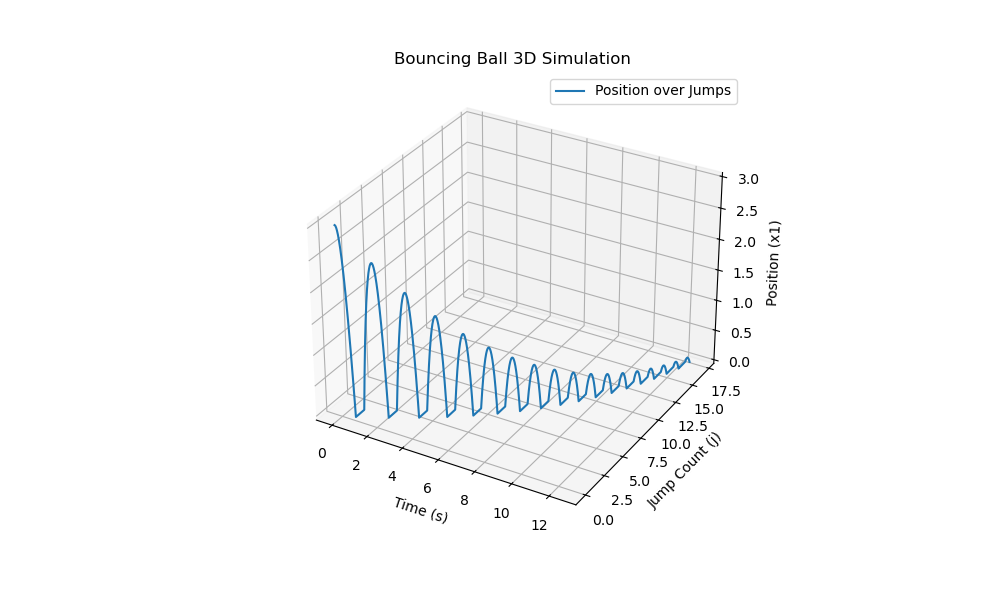
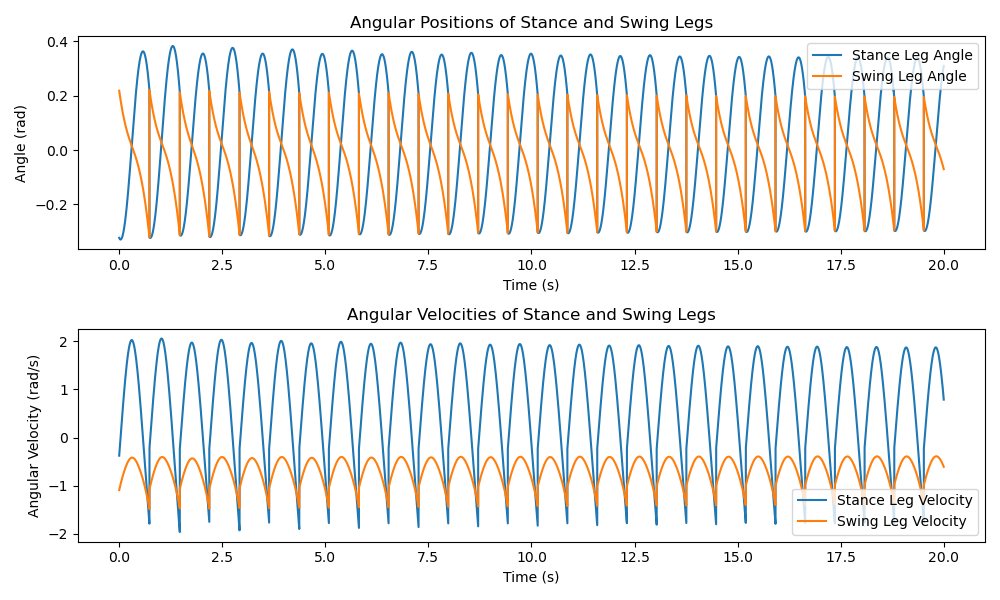

# Hybrid_Systems_Simulation

## Acknowledgements

This project was inspired by and based on the work of [learning-hcbfs](https://github.com/unstable-zeros/learning-hcbfs.git). We borrowed some ideas and code from their implementation of hybrid_integrator, with modifications to suit our specific use case.
